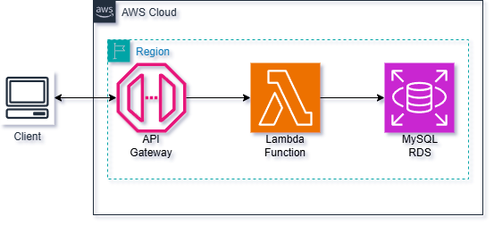
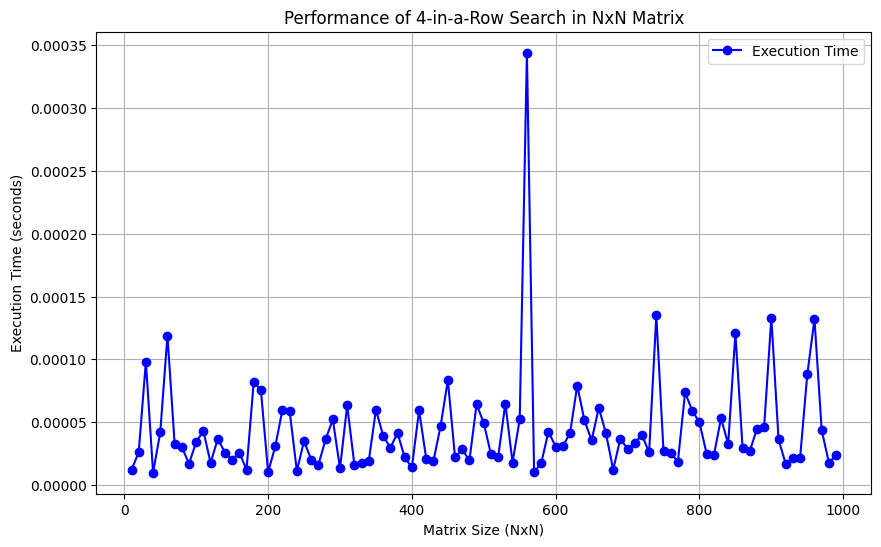

# Meli Challenge

## Infrastructure
MeliApp is desplegated using AWS infrastructure as shown below

## Requeriments
- Python 3.12.5

## Installation
- Create a virtual env with python3.12
`python3.12 -m venv env`
- Activate the virtual env
`source env/bin/activate`
- Install the required packages
`pip install -r requirements.txt`

## Usage

### Via API

| **Method** | **Endpoint**                                                  | **Body**                                                                | **Response**                                                                                              |
|------------|---------------------------------------------------------------|-------------------------------------------------------------------------|-----------------------------------------------------------------------------------------------------------|
| POST       | https://z72xfqpr75.execute-api.us-east-2.amazonaws.com/mutant | `{ "dna": ["TTGCAA", "CAGTGC", "TTATGT", "AGAAGG", "CAGCTA", "TCACTG"] }` | STATUS_CODE = 200 OK   BODY = false                                                                         |
| GET        | https://z72xfqpr75.execute-api.us-east-2.amazonaws.com/stats  |                                                                         | STATUS_CODE = 200 OK BODY = `{     "count_mutant_data": 38,     "count_human_data": 6,     "ratio": 6.33 }` |

### Local
- Activate the virtual env
`source env/bin/activate`
- Run Jupyter Notebook
`jupyter notebook`
- Open the notebook in your browser
- Run the notebook
`notebooks/2.0-ajg-local-usage.ipynb`
- In the cell below to **Input DNA** with the function `process_dna` you can test the function with a DNA sequence
`process_dna(dna: List[str]) -> bool`

## Test
To run testing, use:
`python test.py`

## Perfomance

A test performance was realized to see how the execution time increment in function of matrix size. As a result, until 100x100 matrix, there are no considerable execution times.  

